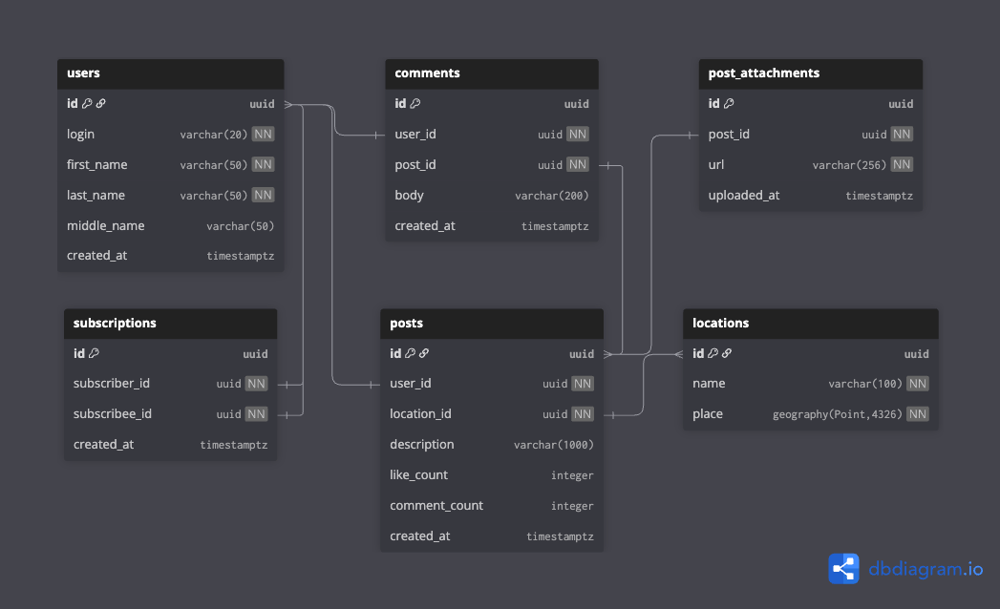

# Trip Max - System Design

Социальная сеть для путешествинников. Проект, выполняемый в рамках курса по [System Design от Владимира Балуна](https://balun.courses/courses/system_design)

### Функциональные требования
- Пользователь может публиковать посты из путешествий
    - Пост должен иметь фотографии
    - Пост должен иметь описание
    - Пост должен иметь привязан к месту путешествия (геометка)
- Пользователь может оставлять реакции под посты других пользователей
- Пользователь может оставлять комментарии под посты других пользователей
- Пользователь может подписываться на других путешествинников
- Пользователь может использовать поиск по популярным местам для путешествий
    - Пользователь может просматривать посты с этих мест
- Пользователь может смотреть ленты других путешественников в обратном хронологическом порядке
- Пользователь может смотреть персонализированную ленту, основанную на подписках в обратном хронологическом порядке

### Нефункциональные требования
- DAU = 10 000 000
- Локация: СНГ
- Доступность: 99.95
- Данные храним всегда
- Система должна быть доступна на мобильных устройствах и через браузер
- Сезонность: 2-ой и 3-ий кварталы. При пиковых нагрузках следует применить коэффициент 1.5

- В среднем каждый пользователь:
    - Просматривает 20 постов ежедневно
    - Публикует 1 пост в неделю с 2 фото
    - Ставит лайки на 50 постов каждую неделю
    - Читает 50 комментариев ежедневно
    - Оставляет 3 комментария ежедневно
    - Подписывается на 5 человек в месяц
    - Ищет 10 популярных мест в месяц
- В среднем каждый пост содержит:
    - 2 фотографии
    - 10 комментариев
- Лимиты
    - Пост содержит не более 1 000 символов
    - Пост содержит не более 10 фотографий
    - Комментарий содержит не более 200 символов
    - Название локации не более 50 символов
    - Размер картинки не более 1 МБ (после сжатия)
    - Пользователь не может иметь больше 100 000 постов
- Тайминги
    - Публикация 1 поста (без фото) не больше 2 секунд
    - Загрузка ленты (10 постов) не больше 1 секунды
    - Загрузка 1 фото должна быть не дольше 5 секунд
    - Загрузка лайков (из кеша) не должна быть больше 500 мс
    - Загрузка комментариев (батчем по 50 штук) не должна быть больше 1 секунды

### Структуры данных
User (300 B):
- id (8 B)
- login (20 B)
- name (100 B * 2.5)

Post (3 KB):
- id (8 B)
- user_id (8 B)
- location_id (8 B)
- attachment_ids (8 B * 10)
- description (1 000 B * 2.5 (utf-8))
- likes (4 B)
- created_at (8 B)

Comment (600 B):
- id (8 B)
- user_id (8 B)
- post_id (8 B)
- body (200 B * 2.5)
- created_at (8 B)

Location (150 B):
- id (8 B)
- name (100 B * 2.5)
- latitude (8 B)
- longitude (8 B)


### Расчет нагрузки и трафика
Посты:
```
RPS (read): 10 000 000 DAU * 20 / 100 000 = 2000
RPS (write): 10 000 000 DAU * 1 / 7 / 100 000 = 14

Traffic (read): 2000 * 3KB = 6 MB/s
Traffic (write): 14 * 3Kb = 42 KB/s
```

Фото:
```
RPS (read): 10 000 000 DAU * 20 * 2 / 100 000 = 4000
RPS (write): 10 000 000 DAU * 1 * 2 / 7 / 100 000 = 28

Traffic (read): 4000 * 1MB = 4 GB/s
Traffic (write): 28 * 1MB = 28 MB/s
```

Лайки:
```
RPS (write): 10 000 000 DAU * 50 / 7 / 100 000 = 714
```

Комментарии:
```
RPS (read): 10 000 000 DAU * 50 / 100 000 = 5000
RPS (write): 10 000 000 DAU * 3 / 100 000 = 300

Traffic (read): 5000 * 600 B = 3 MB/s
Traffic (write): 300 * 600 B = 180 KB/s
```

Подписчики:
```
RPS (write): 10 000 000 DAU * 5 / 30 / 100 000 = 16
```

Поиск популярных мест:
```
RPS (write): 10 000 000 DAU * 10 / 30 / 100 000 = 33

Traffic (read): 33 * 150 B = 5 KB/s
```

### Схема базы данных

